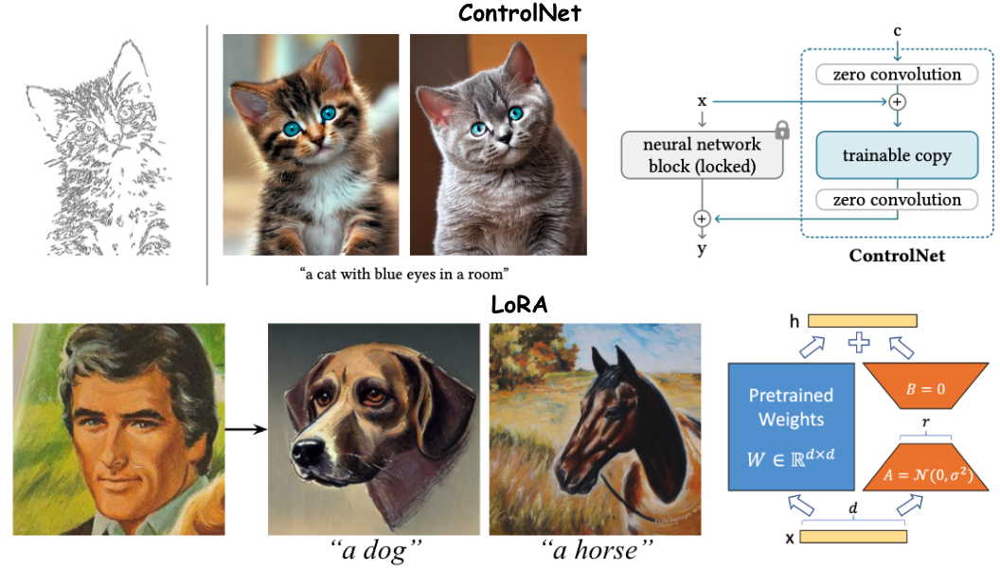
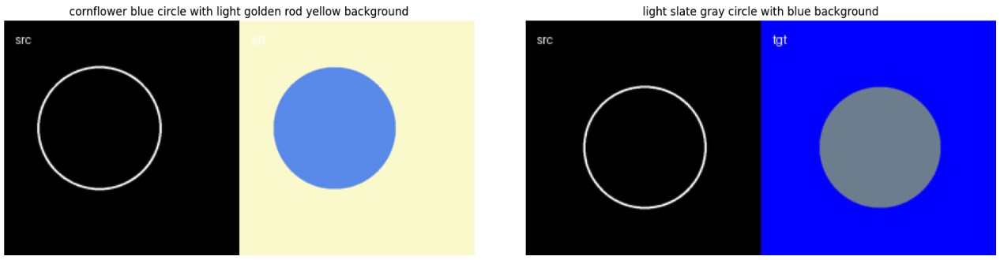
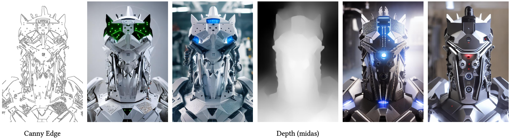
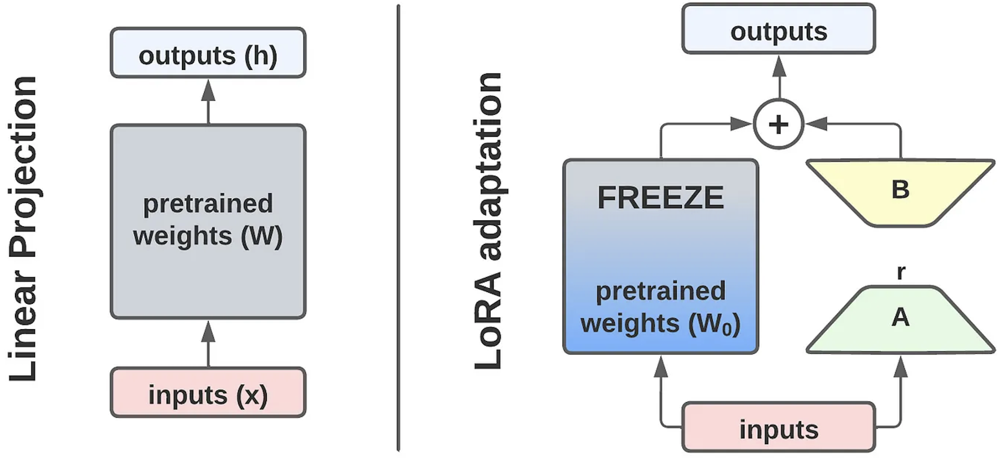
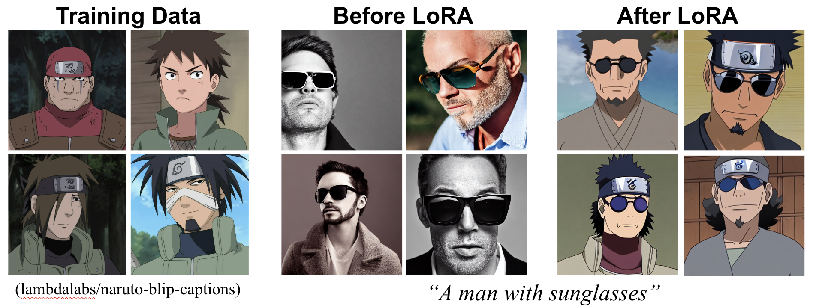
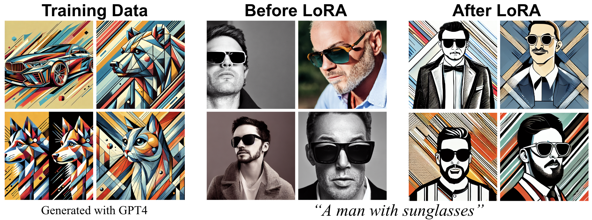
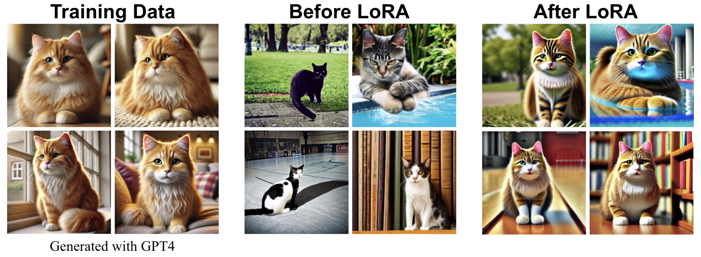

<div align=center>
  <h1>
    ControlNet & LoRA
  </h1>
  <p>
    <a href=https://mhsung.github.io/kaist-cs492d-fall-2024/ target="_blank"><b>KAIST CS492d: Diffusion Models and Their Applications</b></a><br>
    Programming Assignment    
  </p>
</div>

<div align=center>
  <p>
    Instructor: <a href=https://mhsung.github.io target="_blank"><b>Minhyuk Sung</b></a> (mhsung [at] kaist.ac.kr)<br>
    TA: <a href=https://phillipinseoul.github.io/ target="_blank"><b>Yuseung Lee</b></a>  (phillip0701 [at] kaist.ac.kr)
  </p>
</div>

<div align=center>
  
</div>


## Description
In this programming assignment, you will gain hands-on experience with two powerful techniques for training diffusion models for conditional generation: [ControlNet](https://arxiv.org/abs/2302.05543) and [LoRA](https://arxiv.org/abs/2106.09685). 

(1) **ControlNet** enhances text-to-image diffusion models, such as Stable Diffusion, by allowing them to incorporate additional conditions beyond text prompts, such as sketches or depth maps. The main objective of **Task 1** is to implement the core mechanism of ControlNet and train a ControlNet model on a simple dataset consisting of condition inputs and corresponding images.

(2) **LoRA (Low-Rank Adaptation)** is an efficient fine-tuning technique for neural networks that enables the customization of diffusion models with relatively small datasets, ranging from a few images to a few thousand. The main objective of **Task 2** is to become familiar with the LoRA fine-tuning process for diffusion models. Instead of implementing LoRA from scratch, you will utilize a pre-existing LoRA module available in the [diffusers](https://github.com/huggingface/diffusers) library. This task will allow you to creatively develop and fine-tune a diffusion model tailored to your specific data and task requirements. Moreover, you will experiment with [DreamBooth](https://arxiv.org/abs/2208.12242) to create personalized diffusion models based on a particular subject of your choice.

This assignment is heavily based on the [diffusers](https://github.com/huggingface/diffusers) library. You may refer to the relevent materials while working on the tasks below. However, it is strictly forbidden to simply copy, reformat, or refactor the necessary codeblocks when making your submission. You must implement the functionalities on your own with clear understanding of how your code works. As noted in the course website, we will detect such cases with a specialized tool and plagiarism in any form will result in a zero score.

## Setup
Install the required package within the `requirements.txt`.

**NOTE:** Install PyTorch according to the CUDA version of your environment (See [PyTorch Previous Versions](https://pytorch.org/get-started/previous-versions/))
```
conda create -n cs492d python=3.8
conda install pytorch==2.1.0 torchvision==0.16.0 torchaudio==2.1.0 pytorch-cuda=12.1 -c pytorch -c nvidia
pip install -r requirements.txt
```

## Code Structure
<details>
<summary><b>ControlNet (task_1_controlnet)</b></summary>
</br>

```
task_1_controlnet/
├── diffusion
│   ├── unets       
│   │     ├── unet_2d_condition.py  <--- (TODO) Integrate ControlNet outputs into UNet
│   │     └── unet_2d_blocks.py     <--- Basic UNet components
│   ├── controlnet.py               <--- (TODO) Implement ControlNet
│   └── pipeline_controlnet.py      <--- Diffusion model pipeline with ControlNet
├── train.py                        <--- Training code for ControlNet
├── train.sh                        <--- Script with hyperparameters
└── inference.ipynb                 <--- Inference code for ControlNet
```
</details>

<details>
<summary><b>LoRA (task_2_lora)</b></summary>
</br>

```
task_2_lora/
├── scripts
│   ├── train_lora.sh               <--- Training script for LoRA
│   ├── train_lora_custom.sh        <--- Training script for LoRA w/ custom data
│   └── train_dreambooth_lora.py    <--- Training script for DreamBooth + LoRA
├── train_lora.py                   <--- Training code for LoRA
├── train_dreambooth_lora.py        <--- Training code for DreamBooth + LoRA
└── inference.ipynb                 <--- Inference code for trained LoRA
```
</details>

## Task 0. Introduction to Hugging Face and Diffusers
Before diving into the main tasks, we will have a look at [Hugging Face](https://huggingface.co/), an open-source platform that serves as a hub for machine learning applications. [Diffusers](https://github.com/huggingface/diffusers) a go-to library for pretrained diffusion models made by Hugging Face. As we'll be downloading the pretrained Stable Diffusion model from Hugging Face, you'll need to ensure you have access tokens.

Before starting the assignment, please do the following:
* Sign into Hugging Face.
* Obtain your Access Token at `https://huggingface.co/settings/tokens`.
* In your terminal, log into Hugging Face by `$ huggingface-cli login` and enter your Access Token.

You can check whether you have access to Hugging Face using the below code, which downloads Stable Diffusion from Hugging Face and generates an image with it.

```python
import torch
from diffusers import StableDiffusionPipeline

model_id = "CompVis/stable-diffusion-v1-4"
device = "cuda"


pipe = StableDiffusionPipeline.from_pretrained(model_id, torch_dtype=torch.float16)
pipe = pipe.to(device)

prompt = "a photo of an astronaut riding a horse on mars"
image = pipe(prompt).images[0]  
    
image.save("astronaut_rides_horse.png")
```

## Task 1. Training ControlNet on Fill50K Dataset

### How is ControlNet Trained?
Let $`\mathbf{z_0}`$ be an input image. We denote $`c_t`$ as a text prompt, and $`c_f`$ as a task-specific condition for the image (e.g. an edge-map extracted from the image). Then we can obtain a noisy image $`\mathbf{z_{t}}`$ by adding random noise $`\epsilon \sim \mathcal{N}(0, I)`$ to $`\mathbf{z_0}`$ according to timestep $t$. In ControlNet, the neural network $`\epsilon_{\theta}`$ learns to predict the added noise in $`\mathbf{z_t}`$ with the below objective:

$$
\begin{align*}
\mathcal{L} = \mathbb{E}\_{\mathbf{z\_{0}},t,c_t,c_f,\epsilon \sim \mathcal{N}(0,I)} \left[\Vert \epsilon - {\epsilon}\_{\theta}(\mathbf{z\_{t}},t,c_t,c_f)\Vert^2_2 \right].
\end{align*}
$$

which is equal to simply adding an extra condition $c_f$ to the original training objective of text-to-image diffusion models. Please check the [ControlNet](https://arxiv.org/abs/2302.05543) paper for further details.

### Let's Train ControlNet!

Let's first see how Stable Diffusion generate image from text prompts. With the 5 text prompts given in `./task_1_controlnet/data/test_prompts.json`, generate images using Stable Diffusion downloaded in Task 0.

Now, based on Stable Diffusion, you will implement ControlNet with `Fill50K` dataset. This dataset consists of (i) images of circles, (ii) edge map conditions of those circles, and (iii) text prompts describing each image (See below image). Note that you don't have to manually download the dataset, as the `load_dataset()` function in `train.py` will automatically retrieve it from Hugging Face. You can check the details on the dataset [here](https://huggingface.co/datasets/fusing/fill50k).

<div align=center>
  
</div>

Your TODOs for implementing ControlNet are listed below. This assignment is heavily based on [ControlNet](https://arxiv.org/abs/2302.05543) and its implementation in [diffusers](https://github.com/huggingface/diffusers) library. You may refer to the relevent materials while working on the tasks below. However, it is strictly forbidden to simply copy, reformat, or refactor the necessary codeblocks when making your submission.

### TODO

- [ ] Generate 5 images with Stable Diffusion using the text prompts in `data/test_prompts.json`.
- [ ] Implement zero-convolution for ControlNet (`diffusion/controlnet.py` - `TODO (1)`)
- [ ] Initialize ControlNet using a pretrained UNet model (`diffusion/controlnet.py` - `TODO (2)`)
- [ ] Apply zero-convolution to the residual features of each ControlNet block (`diffusion/controlnet.py` - `TODO (3)`)
- [ ] Integrate the outputs from ControlNet blocks into the UNet of Stable Diffusion (`diffusion/unets/unet_2d_condition.py` - `TODO (4)`)
- [ ] Train ControlNet by running `$ sh train.sh`.
- [ ] Generate images with 5 different condition inputs from `./data/test_conditions` and text prompts from `data/test_prompts.json`. (Inference code is `inference.ipynb`)

## (Optional) Task 1-1. Training ControlNet on a Different Condition

<div align=center>
  
  <p>(Credit: <a href="https://arxiv.org/abs/2302.05543">ControlNet</a>)</p>
</div>

After successfully training your ControlNet on the Fill50K dataset, you can obtain bonus points (5pt) by training another ControlNet on a more complex dataset.

You have the flexibility to use an open-source dataset or even create your own by using image processing techniques such as edge detection modules. For examples of conditions to train ControlNet on, refer to [this website](https://huggingface.co/docs/diffusers/using-diffusers/controlnet).

## Task 2. Customized Image Generation with LoRA and DreamBooth

### What is LoRA?

<div align=center>
  
  <p>(Credit: <a href="https://medium.com/@pranjalkhadka/low-rank-adaptation-lora-fedf37b92026">Medium</a>)</p>
</div>

Low-Rank Adaptation (LoRA) enables training specific layers within a neural network in a more efficient manner by focusing on the low-rank decomposition of changes to the pretrained weights. LoRA was first introduced by [He et al.](https://arxiv.org/abs/2106.09685) in the context of large language models (LLMs) and was later applied to diffusion models by [clonesofsimo](https://github.com/cloneofsimo/lora).

The key idea behind LoRA is to optimize the rank decomposition matrices of the "updates" to the neural network's pretrained weights during training, while keeping the original weights frozen. This is particularly effective because pretrained models often have a low "intrinsic dimension," meaning they can still learn efficiently even after their parameter space is reduced by projecting it onto a smaller subspace.

Consider a pretrained weight matrix $`W_0\in\mathbb{R}^{d\times k}`$. Instead of directly updating this matrix, LoRA constrains its update $`\Delta W`$ by representing it as a low-rank decomposition $`BA`$:

$$
\begin{align*}
W_{0} + \Delta W = W_{0} + BA,
\end{align*}
$$

where $`B\in \mathbb{R}^{d\times r}`$, $`A\in \mathbb{R}^{r\times k}`$, and $`\text{rank}(r)\ll \min (d,k)`$.

During training, the pretrained weight matrix $`W_{0}`$ remains fixed, and only the matrices $`A`$ an $`B`$ are updated. For an input $`x`$, where the original forward pass computes $`h=W_{0}x`$, the modified forward pass under LoRA is:

$$
\begin{align*}
h=W_{0}x + \Delta Wx = W_{0}x + BAx.
\end{align*}
$$

This approach significantly reduces the number of parameters that need to be trained, making the training process more efficient while still leveraging the knowledge encoded in the pretrained model.

### Let's Customize Stable Diffusion with LoRA!
Your goal in this task is to create a customized diffusion model by training two distinct types of LoRA models, each using a different dataset:

**[Task 2-1] Train LoRA on a Specific Visual Style**

Train a LoRA for a specific "style". It could be artistic, cinematic, photographic, or any other visual style. A sample dataset in `./sample_data/artistic-custom` can be used for testing, but you should use a different dataset for your submission.

**[Task 2-2] Train DreamBooth with LoRA on a Specific Identity** 

Train DreamBooth with LoRA to capture and reproduce the identity of a specific subject. This could be your own face, your dog, your doll, or any other identifiable subject.

---

### Task 2-1. Train LoRA on a Specific Visual Style

Train a LoRA for a specific "style". It could be artistic, cinematic, photographic, or any other visual style. You have two options to choose a dataset for training LoRA.

**(Option 1) Use an open-source dataset**

You can utilize various open-source image-caption datasets for LoRA training, many of which are available on Hugging Face. For instance, you can explore datasets listed [here](https://huggingface.co/datasets?modality=modality:image&size_categories=or:%28size_categories:n%3C1K,size_categories:1K%3Cn%3C10K%29&sort=trending&search=lora). By replacing the `DATASET_NAME` argument with the desired dataset, you can seamlessly train LoRA with new data. Additionally, you are welcome to use any other open-source datasets, **provided that you clearly cite the appropriate references.**

We provide the code for LoRA training of Stable Diffusion 1.4 in `train_lora.py`. You can simply run the code using:
```bash
$ sh scripts/train_lora.sh
```

The default training dataset is set as:
```bash
$ export DATASET_NAME="lambdalabs/naruto-blip-captions"
```
which consists of Naruto images with synthetic captions generated with [BLIP-2](https://github.com/salesforce/BLIP). The below image shows the outputs of Stable Diffusion before and after LoRA training on this dataset. You can first check if LoRA works properly based on this dataset. The validation images after each epoch will be stored in `{$output_dir}/validation/`.

A simple inference code for Stable Diffusion with LoRA is provided at `inference_lora.ipynb`.

<div align=center>
  
  <p>(Credit: <a href="https://huggingface.co/datasets/lambdalabs/naruto-blip-captions">lambdalabs/naruto-blip-captions</a>)</p>
</div>


**(Option 2) Prepare your own dataset**

**We highly encourage you to try training LoRA on your own creative dataset!** To do so, refer to `src/train_lora_custom.sh` for the necessary arguments to train on a custom dataset. Be sure to update the `TRAIN_DATA_DIR` to point to the directory containing your data. We provide a sample dataset in `./sample_data/artistic-custom` consisting of four images, which were generated using GPT-4. The image below showcases the results of LoRA training on this sample dataset.

Refer to [this link](https://huggingface.co/docs/datasets/v2.4.0/en/image_load#imagefolder) for how to organize the dataset folder. Then, train the LoRA using:

```bash
$ sh scripts/train_lora_custom.sh
```

Note that both during training and inference phases of DreamBooth, an "indicator" is used in the text prompts. For instance, in our `train_dreambooth_lora.sh` script, the token `sks` serves as the indicator for the specific cat. Refer to the original [DreamBooth](https://arxiv.org/abs/2208.12242) paper for details.

<div align=center>
  
</div>


### Task 2-2. Train DreamBooth with LoRA on a Specific Identity

Your objective is to train a DreamBooth model with LoRA to accurately capture and reproduce the identity of a specific subject. This subject could be anything personally meaningful to you, such as your own face, your pet, a favorite doll, or any other identifiable entity.

[DreamBooth](https://arxiv.org/abs/2208.12242) is a fine-tuning technique that allows diffusion models to learn a unique identifier for a specific subject, enabling the generation of images featuring that exact subject post-training. By combining DreamBooth with LoRA, you can achieve this fine-tuning with only a small number of images and in a relatively short time frame.

You can run DreamBooth + LoRA using:
```bash
$ sh scripts/train_dreambooth_lora.sh
```

We provide a sample dataset for training DreamBooth in `./sample_data/dreambooth-cat/`. To use your own data, simply update the `INSTANCE_DIR` to point to your data directory.

<div align=center>
  
</div>

### TODO

- [ ] Train LoRA on a specific visual style.
- [ ] Generate 5 images with different text prompts.
- [ ] Train DreamBooth with LoRA on a specific identity.
- [ ] Generate 5 images with different text prompts.


## What to Submit
For Task 1, you are required to submit the code. For Task 2, you should submit the checkpoints (`pytorch_lora_weights.safetensors`) of each LoRA model (it should be about 3MB each).

Moreover, you are required to submit a maximum 2-page PDF report that includes the following sections:

* Task 1: 

  * **5 different** condition inputs, corresponding text prompts, and the generated images.
  * A brief analysis of the results for each condition.
  * (Optional Task 1-1) **5 different** condition inputs, corresponding text prompts, and the generated images.
  * (Optional Task 1-1) A brief explanation about the training dataset and the training results.

* Task 2:

  * (Task 2-1) Decription on the dataset used, including its source.
  * (Task 2-1) Visualization of training images and and generated image with the corresponding text prompts.
  * (Task 2-2) Decription on the dataset used, including its source.
  * (Task 2-2) Visualization of training images and and generated image with the corresponding text prompts.

## Submission
Submit a zip file named `{NAME}_{STUDENT_ID}.zip` containing the implemented ControlNet code and LoRA checkpoints and the report PDF. Submit the zip file on GradeScope.

You should submit a `.zip` file with name `{STUDENT_ID}_{NAME}.zip` that contains the following contents:
```
.
├── 2024XXXX.pdf        <-- report (max. 2 pages)
├── task_1_controlnet   <-- code for Task 1
├── lora_1              <-- checkpoints for Task 2
│      └── pytorch_lora_weights.safetensors
└── lora_2
       └── pytorch_lora_weights.safetensors
```

<details>
<summary><b>Submission Item List</b></summary>
</br>

- [ ] Code for Task 1
- [ ] Checkpoints for Task 2
- [ ] Report

</details></br>

#### Missing any of the items above will result in a score of zero.

## Grading
You will receive a zero score if:
* you do not submit,
* your code is not executable in the Python environment we provided, or
* you modify any code outside of the section marked with `TODO`.

The scores for each task are detailed as follows:

* Task 1 (10pt):

    * [0pt] Either the code or the report is not submitted.
    * [5pt] Generated images do not align with the input conditions.
    * [10pt] Generated images accurately align with the input conditions.

* Task 2 (10pt):

    * [0pt] The report is not submitted.
    * [5pt] Outputs of either one of the LoRAs do not align with the training data.
    * [10pt] Outputs of both LoRAs accurately align with the training data.

#### Plagiarism in any form will also result in a zero score and will be reported to the university.

## ❗Ethical Usage
While you are encouraged to explore creative possibilities using the above methods, it is crucial that you do not use these personalization techniques for **harmful purposes**, such as generating content that includes nudity, violence, or targets specific identities. It is your responsibility to ensure that this method is applied ethically.

## Further Readings
If you are interested in this topic, we encourage you to check out the materials below.

* [Adding Conditional Control to Text-to-Image Diffusion Models](https://arxiv.org/abs/2302.05543)
* [ControlNet Github](https://github.com/lllyasviel/ControlNet)
* [ControlNet Hugging Face Documentation](https://huggingface.co/docs/diffusers/using-diffusers/controlnet)
* [GLIGEN: Open-Set Grounded Text-to-Image Generation](https://arxiv.org/abs/2301.07093)
* [Style Aligned Image Generation via Shared Attention](https://arxiv.org/abs/2312.02133)
* [StyleDrop: Text-to-Image Generation in Any Style](https://arxiv.org/abs/2306.00983)
* [LoRA: Low-Rank Adaptation of Large Language Models](https://arxiv.org/abs/2106.09685)
* [Low-rank Adaptation for Fast Text-to-Image Diffusion Fine-tuning](https://github.com/cloneofsimo/lora)
* [DreamBooth: Fine Tuning Text-to-Image Diffusion Models for Subject-Driven Generation](https://arxiv.org/abs/2208.12242)
* [Multi-Concept Customization of Text-to-Image Diffusion](https://arxiv.org/abs/2212.04488)
